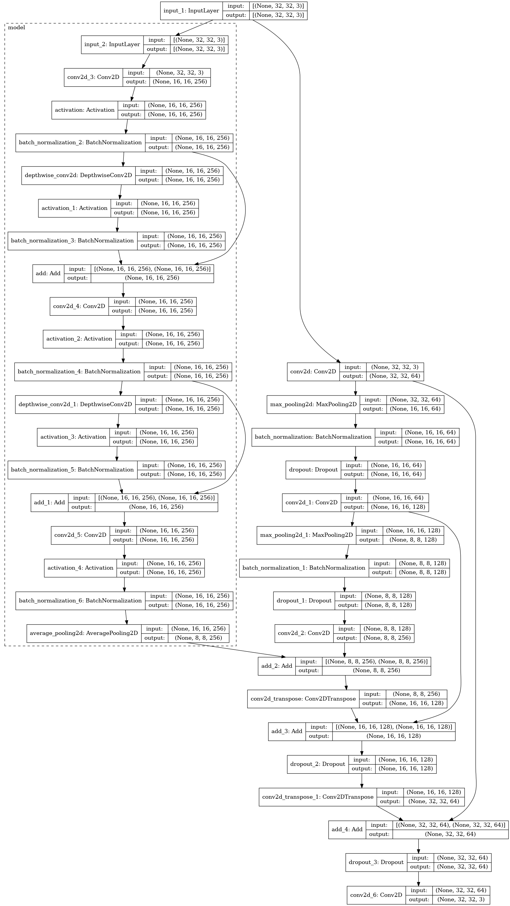

# Image Inpainting using a U-Net model with a fused ConvMixer encoder

In this project, we have tried making use of a fused-encoder architecture with the [U-Net](https://arxiv.org/abs/1505.04597) model for the task of Image Inpainting. The fused-encoder is the recently proposed [ConvMixer](https://openreview.net/forum?id=TVHS5Y4dNvM) architecture which presents a simple yet strong model for feature extraction.  
<b>Complete information about the work can be found here:</b> <strong><i>[REPORT](Image_Inpainting_Report.pdf)</i></strong>

This type of fusion model is inspired by [this project](https://drive.google.com/file/d/1hn9hGkW40AVWv1ZxCaF1Vl86n6d7OyVJ/view) by Ini Oguntola where they used this architecture type for image colorization task. 

The model is visualized below:

The fused encoder i.e. ConvMixer (shown in dotted rectangle) is concatenated at the middle of U-Net in the latent space.

## Code Details
Due to computational constraints, we built the simplest and minimal model possible with ConvMixer `depth = 2` and twice U-Net downsampling with the overall size of image going down to just 1/4th of the original image size. 
The dataset used was CIFAR-10 with 45000 training samples, 5000 validation samples and 10000 test samples.
A random sized rectangular mask used to prepare the dataset. 

To train the model, first do `pip install requirements.txt` in your environment. Then use `train.py` to train your model and save it accordingly. For predictions using the trained model, run `predict.py`.